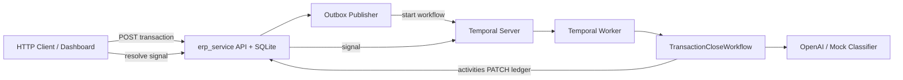
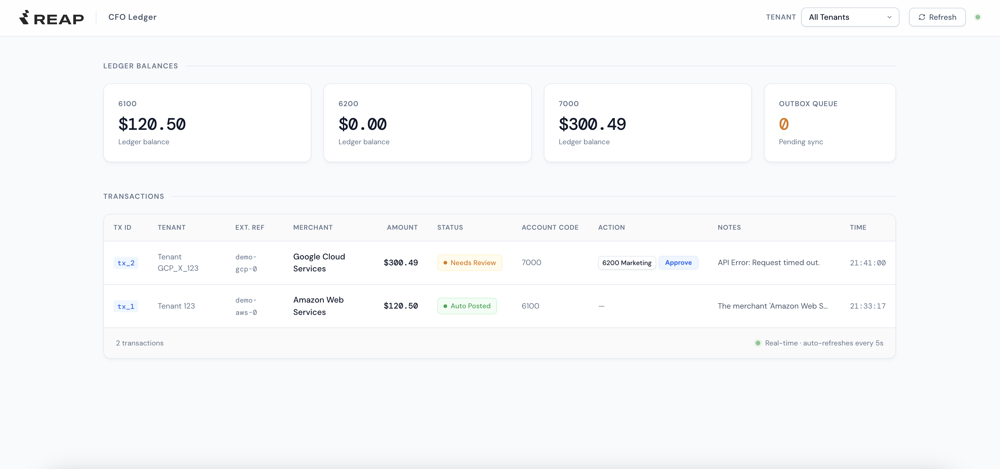

# Reap CFO Agent - Transaction Auto tagging

Transaction auto-tagging and month-end close acceleration for a multi-tenant expense platform. Card and bill spend is ingested into a ledger, classified against each tenant’s chart of accounts (CoA) via an LLM, and posted automatically when confidence is high—or routed to suspense and human review when it is not.

The system is split into two logical services: **ERP** (ledger state, HTTP API, transactional outbox) and **workflow** (Temporal orchestration, AI tagging, activities). They communicate over HTTP and Temporal, not shared in-process calls from workflow code.

**Architecture & system design (Workflow 1, take-home):** [Architecture & Demo](https://drive.google.com/drive/folders/1MnWjrAS2BestAjFOHNHsCc2Rga1oTETH?usp=sharing) — requirements mapping, design patterns, sequence diagrams, rationale (including Temporal vs alternatives) and demo.

---

## What it does

1. **Ingest** — `POST /api/transactions` creates a transaction and an outbox row in one database transaction.
2. **Publish** — `OutboxPublisher` delivers the event and starts a Temporal workflow (random `workflow_id`, stored on the transaction for HITL signals).
3. **Classify** — `TransactionCloseWorkflow` loads CoA + history, runs the OpenAI (or mock) classifier.
4. **Post**
   - **Straight-through** (confidence ≥ 0.85, no human review): status `AUTO_POSTED`, expense account applied.
   - **Human-in-the-loop**: status `NEEDS_REVIEW`, suspense account `7000`, workflow waits for a signal.
5. **Resolve** — Accountant approves via dashboard **Approve** or `POST /api/transactions/{tx_id}/resolve` → status `HUMAN_RESOLVED`, final account code; override is stored in `tagging_feedback` for that tenant’s few-shot history.



---

## Tech stack

| Layer | Technology |
|-------|------------|
| Language | Python 3.11+ |
| Package manager | [uv](https://github.com/astral-sh/uv) |
| HTTP API & dashboard | [FastAPI](https://fastapi.tiangolo.com/) + Uvicorn + [Scalar](https://github.com/scalar/scalar) |
| Persistence | SQLAlchemy + SQLite (`ledger.db` created locally; Docker volume in Compose) |
| Orchestration | [Temporal](https://temporal.io/) (`temporalio` SDK) |
| LLM | OpenAI GPT-4o-mini structured outputs ([Pydantic](https://docs.pydantic.dev/) `TaggingDecision`) |
| Logging | [Loguru](https://github.com/Delgan/loguru) |
| Containers | Docker Compose (PostgreSQL, Temporal, Temporal UI, app) |

---

## Prerequisites

**Option A — Docker (recommended):** Docker Engine 24+ and Compose v2 only.

**Option B — Local processes:**

| Tool | Purpose |
|------|---------|
| Python 3.11+ | Runtime |
| [uv](https://docs.astral.sh/uv/getting-started/installation/) | Dependencies (`uv sync`) |
| [Temporal CLI](https://docs.temporal.io/cli) | Local dev server (`temporal server start-dev`) |
| OpenAI API key  | Real LLM tagging; omit to use built-in mock classifier |

---

## Quick start (Docker)

Runs PostgreSQL, Temporal Server, Temporal UI, and the application in one stack.

```bash
git clone <repo-url>
cd reap_cfo_agent

cp .env.example .env
# Optional: set OPENAI_API_KEY=sk-... in .env for real LLM calls

make up-d
```

| URL | Description |
|-----|-------------|
| http://localhost:8000 | Ledger dashboard (HTML) |
| http://localhost:8000/docs | Interactive API docs ([Scalar](https://github.com/scalar/scalar), bluePlanet, dark) |
| http://localhost:8000/openapi.json | OpenAPI 3.0 schema (JSON) |
| http://localhost:8000/health | Health / readiness probe |
| http://localhost:8080 | Temporal Web UI **Note:** Make sure you are using the correct port, as it depends on how Temporal is running in your environment. In some setups, the port number may be **8233**.
 |

### Dashboard

Open http://localhost:8000 (use `?tenant_id=all` or a specific tenant). The page auto-refreshes every 5 seconds.



Verify from the host:

```bash
make smoke
```

Stop:

```bash
make down      # stop containers
make down-v    # stop and delete volumes (fresh DB + ledger)
```

More detail: [docker/README.md](docker/README.md).

---

## Run without Docker (local development)

### 1. Install dependencies

```bash
uv sync
cp .env.example .env
```

Edit `.env` if you use a real OpenAI key. Leave `OPENAI_API_KEY` empty or unset to use the **mock classifier** (pattern-based: e.g. AWS → `6100`, unknown merchants → review).

### 2. Start Temporal

In a dedicated terminal:

```bash
temporal server start-dev
```

Default gRPC: `localhost:7233` (matches `.env.example`).

### 3. Start the application

```bash
uv run python main.py
```

Logs should show ERP on port `8000`, Temporal worker registered, and outbox publisher running.

### 4. Create a transaction

**Dashboard:** http://localhost:8000/?tenant_id=all (see [Dashboard](#dashboard) above)

**API:**

```bash
curl -X POST http://localhost:8000/api/transactions \
  -H "Content-Type: application/json" \
  -d '{
    "merchant": "Amazon Web Services",
    "amount": 120.50,
    "tenant_id": "123",
    "external_id": "demo-aws-001"
  }'
```

**Smoke script:**

```bash
python scripts/smoke_erp.py
```

### 5. Human review (optional demo path)

Post a long-tail merchant (mock routes to `NEEDS_REVIEW` / suspense `7000`). On the dashboard, use **Approve** on the row, or:

```bash
curl -X POST "http://localhost:8000/api/transactions/tx_1/resolve" \
  -F "account_code=6200"
```

---

## Assumptions and phase 2

| Topic | MVP (this repo) | Production phase 2 |
|-------|-----------------|-------------------|
| **Per-tenant CoA** | Shared default CoA seeded in code; `tenant_id` on transactions | `coa` rows scoped by `tenant_id`; sync from accounting platform |
| **Cold start** | Fresh DB seeds two example tags for tenant `123`; new tenants start with empty history | Import accountant exports or prior-period labels on onboarding |
| **Learning loop** | `tagging_feedback` table updated on `AUTO_POSTED` / `HUMAN_RESOLVED`; `/api/history/{tenant_id}` feeds the classifier | Retrieval / rules engine over feedback; optional fine-tune pipeline |
| **Evals** | Offline mock classifier suite: `make eval` | Golden set in CI + LLM-judge or human review for long-tail vendors |
| **Accounting sync** | ERP ledger PATCH simulates the external GL | Idempotent export to Xero/NetSuite/etc. |

---

## Classifier eval (offline)

Runs the mock classifier against known merchants (no running server or API key):

```bash
make eval
```

Cases cover STP (AWS, Slack, Google Ads) and long-tail routing to review/suspense.

---

## Configuration

Copy [`.env.example`](.env.example) to `.env` at the repository root.

| Variable | Local (process) | Docker Compose |
|----------|-----------------|----------------|
| `TEMPORAL_ADDRESS` | `localhost:7233` | Set in compose: `temporal:7233` |
| `DATABASE_URL` | `sqlite:///ledger.db` | `sqlite:////data/ledger.db` (volume) |
| `ERP_PORT` | `8000` | `8000` (published) |
| `OPENAI_API_KEY` | Your key, or empty for mock | `${OPENAI_API_KEY:-mock-key}` |
| `TEMPORAL_TASK_QUEUE` | `transaction-tagging-queue` | Same |

Compose reads `.env` from the repo root for variable substitution when you run `make` or `docker compose -f docker/compose.yml`.

---

## API documentation

The ERP exposes a machine-readable OpenAPI schema and an interactive reference UI powered by **[Scalar](https://github.com/scalar/scalar)** (`scalar-fastapi`). Default Swagger UI and ReDoc are disabled so `/docs` serves Scalar only.

| Resource | URL |
|----------|-----|
| Interactive docs | http://localhost:8000/docs |
| OpenAPI JSON | http://localhost:8000/openapi.json |

**Scalar settings**

| Setting | Value |
|---------|--------|
| Theme | `bluePlanet` |
| Default appearance | Dark mode (`forceDarkModeState: dark`) |
| Try-it-out | Available per operation in Scalar |

Open the docs after `python main.py` or `make up-d`, then browse endpoints grouped by tag (**Health**, **Transactions**, **Chart of accounts**, **Tagging history**). Use **Try it** on `POST /api/transactions` to ingest a sample transaction without `curl`.

To import the spec elsewhere (Postman, Insomnia, codegen):

```bash
curl -s http://localhost:8000/openapi.json -o openapi.json
```

---

## Health API

`GET /health` is the **liveness/readiness** endpoint used by Docker Compose (`docker/compose.yml` healthcheck) and suitable for load balancers or Kubernetes probes.

### Response

| Field | Type | Description |
|-------|------|-------------|
| `status` | `healthy` \| `degraded` \| `unhealthy` | Aggregate result |
| `version` | string | API version (currently `0.1.0`) |
| `checks` | array | Per-dependency probe results |

Each check:

| Field | Type | Description |
|-------|------|-------------|
| `name` | string | `database` or `temporal` |
| `status` | `ok` \| `degraded` \| `error` | Result for that dependency |
| `detail` | string (optional) | Human-readable note when not `ok` |

### HTTP status codes

| `status` | HTTP | Meaning |
|----------|------|---------|
| `healthy` | **200** | Database OK and Temporal client connected |
| `degraded` | **200** | Database OK but Temporal not connected (API up; workflows will not run) |
| `unhealthy` | **503** | Database probe failed — do not route traffic |

### Checks

| Check | `ok` | `degraded` | `error` |
|-------|------|------------|---------|
| **database** | `SELECT 1` succeeds | — | SQLAlchemy / SQLite error |
| **temporal** | Worker client connected at boot | Client not connected | — |

### Examples

**Healthy** (Temporal running):

```bash
curl -s http://localhost:8000/health | jq
```

```json
{
  "status": "healthy",
  "version": "0.1.0",
  "checks": [
    {"name": "database", "status": "ok"},
    {"name": "temporal", "status": "ok"}
  ]
}
```

**Degraded** (ERP up, Temporal down or not started):

```json
{
  "status": "degraded",
  "version": "0.1.0",
  "checks": [
    {"name": "database", "status": "ok"},
    {
      "name": "temporal",
      "status": "degraded",
      "detail": "Temporal client not connected (ingest works; workflows will not run)"
    }
  ]
}
```

**Unhealthy** (database unavailable) — HTTP **503**:

```json
{
  "status": "unhealthy",
  "version": "0.1.0",
  "checks": [
    {"name": "database", "status": "error", "detail": "..."},
    {"name": "temporal", "status": "ok"}
  ]
}
```

Docker Compose waits until `/health` returns success before marking the `app` service healthy.

---

## Business API

Ledger and workflow endpoints (full request/response shapes in Scalar at `/docs`).

| Method | Path | Description |
|--------|------|-------------|
| `GET` | `/` | Ledger dashboard (HTML, not in OpenAPI) |
| `GET` | `/api/coa/{tenant_id}` | Chart of accounts |
| `GET` | `/api/history/{tenant_id}` | Tenant-scoped tagging history (DB; grows with auto-post and HITL) |
| `POST` | `/api/transactions` | Create transaction (triggers workflow via outbox) |
| `PATCH` | `/api/transactions/{tx_id}` | Update status / account (query params) |
| `POST` | `/api/transactions/{tx_id}/resolve` | Signal workflow for HITL approval (`account_code` form field) |

Example create body:

```json
{
  "merchant": "Slack Technologies",
  "amount": 45.0,
  "tenant_id": "123",
  "external_id": "optional-idempotency-key"
}
```

---

## Repository layout

```
reap_cfo_agent/
├── main.py                      # Entrypoint → bootstrap.app.run()
├── bootstrap/
│   ├── app.py                   # Wires DB, ERP server, Temporal, outbox, worker
│   ├── config.py                # Environment settings
│   ├── db.py                    # Database initialization
│   ├── server.py                # Uvicorn / dashboard thread
│   ├── temporal.py              # Temporal client & worker
│   └── publisher.py             # Workflow trigger + circuit breaker
├── erp_service/
│   ├── api/                     # FastAPI router, health, Scalar /docs, dashboard
│   │   ├── health.py            # /health probes (database, Temporal)
│   │   └── router.py            # Routes + OpenAPI metadata
│   ├── core/database/           # SQLAlchemy models & repository (outbox)
│   ├── core/seeds.py            # Default CoA + cold-start examples
│   └── core/publisher.py        # Outbox polling / notify
├── workflow_service/
│   ├── workflows/               # TransactionCloseWorkflow (STP + HITL)
│   ├── activities/              # ERP + LLM side effects
│   ├── agents/                  # ClassifierAgent + LlmClassifierAgent (mock without API key)
│   └── models/                  # Pydantic schemas (TaggingDecision)
├── scripts/
│   ├── smoke_erp.py             # Manual HTTP smoke checks
│   └── eval_tagging.py          # Offline classifier eval (mock)
├── docker/                      # Dockerfile, compose.yml, entrypoint
├── Makefile                     # compose, smoke, eval shortcuts
├── pyproject.toml
└── .env.example
```

---

## Make targets

```bash
make help     # List targets
make up       # Compose up (foreground, build)
make up-d     # Compose up (detached, build)
make down     # Compose down
make down-v   # Compose down + remove volumes
make logs     # Follow app container logs
make build    # Build app image only
make smoke    # Run scripts/smoke_erp.py against localhost:8000
make eval     # Offline mock classifier eval
```

---

## Transaction statuses

| Status | Meaning |
|--------|---------|
| `PENDING` | Created; workflow not finished |
| `AUTO_POSTED` | High-confidence auto-tag applied |
| `NEEDS_REVIEW` | In suspense (`7000`); awaiting human signal |
| `HUMAN_RESOLVED` | Accountant override applied |

---

## Troubleshooting

| Symptom | Check |
|---------|--------|
| No workflow / stuck `PENDING` | Temporal running? `TEMPORAL_ADDRESS` correct? App logs for worker errors. |
| `No workflow` on Approve | Transaction created before `workflow_id` was stored; create a **new** transaction after restart. |
| Mock always goes to review | Expected without API key for unknown merchants; try `Amazon Web Services` for STP demo. |
| OpenAI timeout / 5xx | Up to **3 retries** (4 attempts total, SDK retries off), then suspense `7000` + `NEEDS_REVIEW`. |
| Empty history for new tenant | Normal cold start; post and resolve a few txs or add bootstrap rows in `seeds.py`. |
| Port 8000 in use | Change `ERP_PORT` in `.env` and compose port mapping. |
| Docker app exits early | Wait for Temporal health; see `docker compose -f docker/compose.yml logs app`. |
| `/health` returns `degraded` | Start Temporal (`temporal server start-dev` locally, or wait for Compose `temporal` service). |
| `/health` returns **503** | Database path wrong or volume corrupt; check `DATABASE_URL` or `make down-v` for a fresh volume. |
| `/docs` shows light theme | Hard-refresh; Scalar is configured for **bluePlanet** + forced **dark** mode. |

---

## License

Internal / take-home submission — adjust as needed for your distribution.
