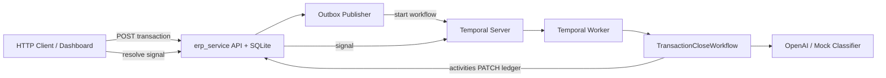

# Reap CFO Agent

Transaction auto-tagging and month-end close acceleration for a multi-tenant expense platform. Card and bill spend is ingested into a ledger, classified against each tenant’s chart of accounts (CoA) via an LLM, and posted automatically when confidence is high—or routed to suspense and human review when it is not.

The system is split into two logical services: **ERP** (ledger state, HTTP API, transactional outbox) and **workflow** (Temporal orchestration, AI tagging, activities). They communicate over HTTP and Temporal, not shared in-process calls from workflow code.

---

## What it does

1. **Ingest** — `POST /api/transactions` creates a transaction and an outbox row in one database transaction.
2. **Publish** — `OutboxPublisher` delivers the event and starts a Temporal workflow (`tagging-{tx_id}`).
3. **Classify** — `TransactionCloseWorkflow` loads CoA + history, runs the OpenAI (or mock) classifier.
4. **Post**
   - **Straight-through** (confidence ≥ 0.85, no human review): status `AUTO_POSTED`, expense account applied.
   - **Human-in-the-loop**: status `NEEDS_REVIEW`, suspense account `7000`, workflow waits for a signal.
5. **Resolve** — Accountant approves via dashboard **Approve** or `POST /api/transactions/{tx_id}/resolve` → status `HUMAN_RESOLVED`, final account code, learning-loop activity (mock persistence).



---

## Tech stack

| Layer | Technology |
|-------|------------|
| Language | Python 3.11+ |
| Package manager | [uv](https://github.com/astral-sh/uv) |
| HTTP API & dashboard | [FastAPI](https://fastapi.tiangolo.com/) + Uvicorn |
| Persistence | SQLAlchemy + SQLite (`ledger.db` locally, volume in Docker) |
| Orchestration | [Temporal](https://temporal.io/) (`temporalio` SDK) |
| LLM | OpenAI GPT-4o-mini structured outputs ([Pydantic](https://docs.pydantic.dev/) `TaggingDecision`) |
| Logging | [Loguru](https://github.com/Delgan/loguru) |
| Containers | Docker Compose (PostgreSQL, Temporal, Temporal UI, app) |

---

## Prerequisites

**Option A — Docker (recommended):** Docker Engine 24+ and Compose v2 only.

**Option B — Local processes:**

| Tool | Purpose |
|------|---------|
| Python 3.11+ | Runtime |
| [uv](https://docs.astral.sh/uv/getting-started/installation/) | Dependencies (`uv sync`) |
| [Temporal CLI](https://docs.temporal.io/cli) | Local dev server (`temporal server start-dev`) |
| OpenAI API key (optional) | Real LLM tagging; omit to use built-in mock classifier |

---

## Quick start (Docker)

Runs PostgreSQL, Temporal Server, Temporal UI, and the application in one stack.

```bash
git clone <repo-url>
cd reap_cfo_agent

cp .env.example .env
# Optional: set OPENAI_API_KEY=sk-... in .env for real LLM calls

make up-d
```

| URL | Description |
|-----|-------------|
| http://localhost:8000 | ERP dashboard & REST API |
| http://localhost:8080 | Temporal Web UI |

Verify from the host:

```bash
make smoke
```

Stop:

```bash
make down      # stop containers
make down-v    # stop and delete volumes (fresh DB + ledger)
```

More detail: [docker/README.md](docker/README.md).

---

## Run without Docker (local development)

### 1. Install dependencies

```bash
uv sync
cp .env.example .env
```

Edit `.env` if you use a real OpenAI key. Leave `OPENAI_API_KEY` empty or unset to use the **mock classifier** (pattern-based: e.g. AWS → `6100`, unknown merchants → review).

### 2. Start Temporal

In a dedicated terminal:

```bash
temporal server start-dev
```

Default gRPC: `localhost:7233` (matches `.env.example`).

### 3. Start the application

```bash
python main.py
```

Logs should show ERP on port `8000`, Temporal worker registered, and outbox publisher running.

### 4. Create a transaction

**Dashboard:** http://localhost:8000/?tenant_id=all  

**API:**

```bash
curl -X POST http://localhost:8000/api/transactions \
  -H "Content-Type: application/json" \
  -d '{
    "merchant": "Amazon Web Services",
    "amount": 120.50,
    "tenant_id": "123",
    "external_id": "demo-aws-001"
  }'
```

**Smoke script:**

```bash
python scripts/smoke_erp.py
```

### 5. Human review (optional demo path)

Post a long-tail merchant (mock routes to `NEEDS_REVIEW` / suspense `7000`). On the dashboard, use **Approve** on the row, or:

```bash
curl -X POST "http://localhost:8000/api/transactions/tx_1/resolve" \
  -F "account_code=6200"
```

---

## Configuration

Copy [`.env.example`](.env.example) to `.env` at the repository root.

| Variable | Local (process) | Docker Compose |
|----------|-----------------|----------------|
| `TEMPORAL_ADDRESS` | `localhost:7233` | Set in compose: `temporal:7233` |
| `DATABASE_URL` | `sqlite:///ledger.db` | `sqlite:////data/ledger.db` (volume) |
| `ERP_PORT` | `8000` | `8000` (published) |
| `OPENAI_API_KEY` | Your key, or empty for mock | `${OPENAI_API_KEY:-mock-key}` |
| `TEMPORAL_TASK_QUEUE` | `transaction-tagging-queue` | Same |

Compose reads `.env` from the repo root for variable substitution when you run `make` or `docker compose -f docker/compose.yml`.

---

## HTTP API

| Method | Path | Description |
|--------|------|-------------|
| `GET` | `/` | Ledger dashboard (HTML) |
| `GET` | `/api/coa/{tenant_id}` | Chart of accounts |
| `GET` | `/api/history/{tenant_id}` | Few-shot tagging history |
| `POST` | `/api/transactions` | Create transaction (triggers workflow via outbox) |
| `PATCH` | `/api/transactions/{tx_id}` | Update status / account (query params) |
| `POST` | `/api/transactions/{tx_id}/resolve` | Signal workflow for HITL approval (`account_code` form field) |

Example create body:

```json
{
  "merchant": "Slack Technologies",
  "amount": 45.0,
  "tenant_id": "123",
  "external_id": "optional-idempotency-key"
}
```

---

## Repository layout

```
reap_cfo_agent/
├── main.py                      # Entrypoint → bootstrap.app.run()
├── bootstrap/
│   ├── app.py                   # Wires DB, ERP server, Temporal, outbox, worker
│   ├── config.py                # Environment settings
│   ├── db.py                    # Database initialization
│   ├── server.py                # Uvicorn / dashboard thread
│   ├── temporal.py              # Temporal client & worker
│   └── publisher.py             # Workflow trigger + circuit breaker
├── erp_service/
│   ├── api/                     # FastAPI router, dashboard HTML
│   ├── core/database/           # SQLAlchemy models & repository (outbox)
│   ├── core/publisher.py        # Outbox polling / notify
│   └── mock_data/               # Seed CoA & history JSON
├── workflow_service/
│   ├── workflows/               # TransactionCloseWorkflow (STP + HITL)
│   ├── activities/              # ERP + LLM side effects
│   ├── agents/                  # OpenAI / mock classifier
│   └── models/                  # Pydantic schemas (TaggingDecision)
├── scripts/
│   └── smoke_erp.py             # Manual HTTP smoke checks
├── docker/                      # Dockerfile, compose.yml, entrypoint
├── Makefile                     # compose & smoke shortcuts
├── pyproject.toml
└── .env.example
```

---

## Make targets

```bash
make help     # List targets
make up       # Compose up (foreground, build)
make up-d     # Compose up (detached, build)
make down     # Compose down
make down-v   # Compose down + remove volumes
make logs     # Follow app container logs
make build    # Build app image only
make smoke    # Run scripts/smoke_erp.py against localhost:8000
```

---

## Transaction statuses

| Status | Meaning |
|--------|---------|
| `PENDING` | Created; workflow not finished |
| `AUTO_POSTED` | High-confidence auto-tag applied |
| `NEEDS_REVIEW` | In suspense (`7000`); awaiting human signal |
| `HUMAN_RESOLVED` | Accountant override applied |

---

## Troubleshooting

| Symptom | Check |
|---------|--------|
| No workflow / stuck `PENDING` | Temporal running? `TEMPORAL_ADDRESS` correct? App logs for worker errors. |
| `No workflow` on Approve | Transaction created before `workflow_id` was stored; create a **new** transaction after restart. |
| Mock always goes to review | Expected without API key for unknown merchants; try `Amazon Web Services` for STP demo. |
| Port 8000 in use | Change `ERP_PORT` in `.env` and compose port mapping. |
| Docker app exits early | Wait for Temporal health; see `docker compose -f docker/compose.yml logs app`. |

---

## License

Internal / take-home submission — adjust as needed for your distribution.
